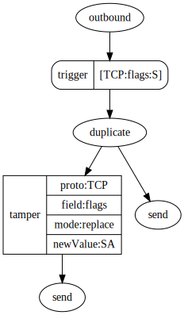

# geneva, an implementation of Geneva rules for Go

This is a reimplementation of the client- and server-side rule processing mechanisms of the [Geneva][geneva] project.

Geneva is both a method to describe ways of manipulating packets to attempt to circumvent censorship, and a genetic
algoritm (_GENetic EVAsion_) that one can deploy to discover new circumventions. (This package does not implement the
genetic algorithm.) More broadly, though, one can encode arbitrary instructions for packet manipulation using Geneva
rules as a sort of "standard syntax", although the use case outside of censorship circumvention may be somewhat tenuous.

This package aims to implement the same triggers and actions that the Geneva project's canonical Python package
does. _Please note: this package is a work-in-progress, and there are still things left to implement._

## Quick Background

Geneva rules are called _strategies_. A strategy consists of zero or more _action trees_ that can be applied to inbound
or outbound packets. The actions trees define both a _trigger_ and a tree of actions to take on a packet if the trigger
matches. The result of an action tree will be zero or more packets that should replace the original packet, which then
can be reinjected into the host OS' network stack.

## Strategies, Forests, and Action Trees

Let's work from the top down. A strategy, conceptually, looks like this:

    outbound-forest \/ inbound-forest

_outbound-forest_ and _inbound-forest_ are ordered lists of _(trigger, action tree)_ pairs. The Geneva paper calls these
ordered lists _forests_. The outbound and inbound forests are separated by the `\/` characters (that is a backslash
followed by a forward-slash); if the strategy omits one or the other, then that side of the `\/` is left empty. For
example, a strategy that only includes an outbound forest would take the form `outbound \/`, whereas an inbound-only
strategy would be `\/ inbound`.

The original Geneva paper does not have a name for these (trigger, action tree) pairs. In practice, however, the Python
code actually defines an action tree as a (trigger, action) pair, where the "action" is the root of a tree of
actions. This package follows this nomenclature as well.

A real example, taken from the [original paper][geneva-paper] (pg 2202), would look like this:

    [TCP:flags:S]-
       duplicate(
          tamper{TCP:flags:replace:SA}(
             send),
           send)-| \/
    [TCP:flags:R]-drop-|

In this example, the outbound forest would trigger on TCP packets that have just the `SYN` flag set, and would perform a
few different actions on those packets. The inbound forest would only apply to TCP packets with the `RST` flag set, and
would simply drop them. Each of the forests in the example are made up of a single (trigger, action tree) pair.

The outbound forest for the above action in graph form looks like this:

In a forest, each action tree must adhere to the syntax `[trigger]-action-|`. Currently, the parser for this package is
stricter than the original; this is a bug.

## Triggers

A trigger defines a way to match packets so that an action tree can be applied to them. In the example above, the first
trigger is `[TCP:flags:S]`. This is a trigger that matches on the TCP segment's _flags_ field, and requires that only
the `SYN` flag be set. (Note that this trigger will not fire for packets that have, i.e., both `SYN` and `ACK` set.) If
the packet is not a TCP packet, or the flags do not match exactly, then this trigger will not fire.

## Actions

An action simply encodes steps to manipulate a packet. There are a number of actions described in the Geneva paper:

### send

The "send" action simply yields the given packet. (A quirk—what the paper calls canonical syntax—is to elide any "send"
actions in the action tree. For instance, the action "duplicate(,)" is equivalent to "duplicate(send,send)". Bear this
in mind when reading Geneva strategies!)

### drop

The "drop" action discards the given packet.

### duplicate(a1, a2)

The "duplicate" action copies the original packet, then applies action `a1` to the original and `a2` to the copy. For
example, if `a1` and `a2` are both "send" actions, then the action will yield two packets identical to the first.

### fragment{protocol:offset:inOrder}(a1, a2)

The "fragment" action takes the original packet and fragments it, applying `a1` to one of the fragments and `a2` to the
other. Since both the IP and TCP layers support fragmentation, the rule must specify which layer's payload to
fragment. The first fragment will include up to _offset_ bytes of the layer's payload; the second fragment will contain
the rest. As an example, given an IPv4 packet with a 60-byte payload and an 8-byte offset, the first fragment will have
the same IP header as the original packet (aside from the fields that must be fixed) and then the first eight bytes of
the payload. The second fragment will contain the other 52 bytes. (You can also indicate that the fragments be returned
out-of-order; i.e., reversed, by specifying "False" for the _inOrder_ argument.)

### tamper{protocol:field:mode[:newValue]}(a1)

The "tamper" action takes the original packet and modifies it in some fashion, depending on the protocol, field, and
mode given. There are two modes: replace and corrupt. The "replace" mode will replace the value of the given field with
newValue, while the "corrupt" mode will replace the value with random data. (Note that there are other modes that the
Python code supports that are not defined in the original Geneva paper.)

Additionally, note that not all actions are valid for both inbound and outbound directions. The Python code mentions
that "branching actions are not supported on inbound trees". Practically, this means that the duplicate and fragment
actions can only be applied to outbound packets, while the sleep, drop, and tamper actions can apply to packets of
either direction. (Note that this package does not currently enforce this; this is also a bug.)

## Credits

See https://censorship.ai for more information about Geneva itself.

[geneva]: https://censorship.ai
[geneva-paper]: https://geneva.cs.umd.edu/papers/geneva_ccs19.pdf
