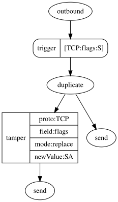

# geneva, an implementation of Geneva rules for Go

This is a reimplementation of the client- and server-side rule processing mechanisms of the [Geneva][geneva] project.

Geneva is both a method to describe ways of manipulating packets to attempt to circumvent censorship, and a genetic
algorithm (_GENetic EVAsion_) that one can deploy to discover new circumventions. This package does not implement the
population manager or evaluator; the dependency-free `mutate` package provides the strategy mutation and crossover
primitives those systems need. More broadly, though, one can encode arbitrary instructions for packet manipulation using Geneva
rules as a sort of "standard syntax", although the use case outside of censorship circumvention may be somewhat tenuous.

This package aims to implement the same triggers and actions that the Geneva project's canonical Python package
does. _Please note: this package is a work-in-progress, and there are still things left to implement._

## Quick Background

Geneva rules are called _strategies_. A strategy consists of zero or more _action trees_ that can be applied to inbound
or outbound packets. The actions trees define both a _trigger_ and a tree of actions to take on a packet if the trigger
matches. The result of an action tree will be zero or more packets that should replace the original packet, which then
can be reinjected into the host OS' network stack.

## Strategies, Forests, and Action Trees

Let's work from the top down. A strategy, conceptually, looks like this:

    outbound-forest \/ inbound-forest

_outbound-forest_ and _inbound-forest_ are ordered lists of _(trigger, action tree)_ pairs. The Geneva paper calls these
ordered lists _forests_. The outbound and inbound forests are separated by the `\/` characters (that is a backslash
followed by a forward-slash); if the strategy omits one or the other, then that side of the `\/` is left empty. For
example, a strategy that only includes an outbound forest would take the form `outbound \/`, whereas an inbound-only
strategy would be `\/ inbound`.

The original Geneva paper does not have a name for these (trigger, action tree) pairs. In practice, however, the Python
code actually defines an action tree as a (trigger, action) pair, where the "action" is the root of a tree of
actions. This package follows this nomenclature as well.

A real example, taken from the [original paper][geneva-paper] (pg 2202), would look like this:

    [TCP:flags:S]-
       duplicate(
          tamper{TCP:flags:replace:SA}(
             send),
           send)-| \/
    [TCP:flags:R]-drop-|

In this example, the outbound forest would trigger on TCP packets that have just the `SYN` flag set, and would perform a
few different actions on those packets. The inbound forest would only apply to TCP packets with the `RST` flag set, and
would simply drop them. Each of the forests in the example are made up of a single (trigger, action tree) pair.

The outbound forest for the above action in graph form looks like this:

In a forest, each action tree must adhere to the syntax `[trigger]-action-|`. The action is optional: canonical Geneva allows trigger-only passthrough trees such as `[TCP:flags:A]-|`, and parses strategies wrapped in a single pair of hanging double quotes (e.g. `"\/ [TCP:flags:A]-drop-|"`). The parser rejects branching actions
(`duplicate` and `fragment`) in inbound trees because inbound evaluation is single-in/single-out.

## Triggers

A trigger defines a way to match packets so that an action tree can be applied to them. In the example above, the first
trigger is `[TCP:flags:S]`. This is a trigger that matches on the TCP segment's _flags_ field, and requires that only
the `SYN` flag be set. (Note that this trigger will not fire for packets that have, i.e., both `SYN` and `ACK` set.) If
the packet is not a TCP packet, or the flags do not match exactly, then this trigger will not fire. As a
compatibility note (matching canonical Geneva), earlier versions of this library treated a bare flag set such as
`[TCP:flags:A]` as a *subset* match that fired whenever at least those bits were set; matching is now exact. To opt
back into subset matching, append a `*`: `[TCP:flags:A*]` fires for any segment with ACK set.

Triggers may include a fourth, integer gas field. Positive gas bounds how many matching packets can fire the tree,
zero disables it, and negative gas is a bomb that starts firing after that many matching packets. For example,

An empty trigger value is only valid where it denotes "no data": `[TCP:load:]` matches packets with no payload, and
data-less options such as `[TCP:options-sackok:]` match their option whenever present. Empty values on all other
fields are rejected when parsing or validating, since they could only ever produce a trigger that never fires.
`[TCP:flags:S:2]` fires twice, while `[TCP:flags:S:-2]` suppresses two matches and fires from the third onward.

## Actions

An action simply encodes steps to manipulate a packet. There are a number of actions described in the Geneva paper:

### send

The "send" action simply yields the given packet. (A quirk—what the paper calls canonical syntax—is to elide any "send"
actions in the action tree. For instance, the action "duplicate(,)" is equivalent to "duplicate(send,send)". Bear this
in mind when reading Geneva strategies!)

### drop

The "drop" action discards the given packet.

### duplicate(a1, a2)

The "duplicate" action copies the original packet, then applies action `a1` to the original and `a2` to the copy. For
example, if `a1` and `a2` are both "send" actions, then the action will yield two packets identical to the first.

### fragment{protocol:offset:inOrder}(a1, a2)

The "fragment" action takes the original packet and fragments it, applying `a1` to one of the fragments and `a2` to the
other. Since both the IP and TCP layers support fragmentation, the rule must specify which layer's payload to
fragment. The first fragment will include up to _offset_ bytes of the layer's payload; the second fragment will contain
the rest. As an example, given an IPv4 packet with a 60-byte payload and an 8-byte offset, the first fragment will have
the same IP header as the original packet (aside from the fields that must be fixed) and then the first eight bytes of
the payload. The second fragment will contain the other 52 bytes. (You can also indicate that the fragments be returned
out-of-order; i.e., reversed, by specifying "False" for the _inOrder_ argument.) TCP fragmentation also supports an
optional fourth _overlap_ field, e.g., `fragment{TCP:8:True:4}`, which repeats that many bytes of payload in both
fragments.

### tamper{protocol:field:mode[:newValue]}(a1)

The "tamper" action takes the original packet and modifies it in some fashion, depending on the protocol, field, and
mode given. There are three modes: replace, corrupt, and add. The "replace" mode will replace the value of the given
field with newValue; the "corrupt" mode will replace the value with random data; and the "add" mode adds newValue to
the field's current value, wrapping at the field's bit size. Add mode is only valid for numeric scalar fields (e.g.,
`seq`, `ack`, `ttl`); it is rejected for the flags bitmap, payload (`load`), options, and address fields. (Note that
`add` is one of the modes the Python code supports that are not defined in the original Geneva paper.)

### sleep{seconds}(a1)

The "sleep" action pauses for the given duration — expressed in (fractional) seconds, e.g., `sleep{0.5}` — before
applying its child action, and therefore before the resulting packets are emitted. The pause is synchronous, so in a
per-packet processing model it delays only the packet being processed. As in canonical Geneva, the child action is
optional: `sleep{1}` is shorthand for `sleep{1}(send)`.

Additionally, note that not all actions are valid for both inbound and outbound directions. The Python code mentions
that "branching actions are not supported on inbound trees". Practically, this means that the duplicate and fragment
actions can only be applied to outbound packets, while the drop, tamper, and sleep actions can apply to packets of
either direction. The parser and `Validate` enforce this constraint.

## Disclaimer

Currently only IPv4 and TCP are supported. There are plans to add support for UDP in the future (although pull requests
are welcome! Look at `TCPTamperAction` and `IPv4TamperAction` in `actions/tamper_action.go` as examples.
`UDPTamperAction` must implement the `actions.Action` interface). There are no plans at the moment to add support 
for IPv6.

## Credits

See https://censorship.ai for more information about Geneva itself.

[geneva]: https://censorship.ai
[geneva-paper]: https://geneva.cs.umd.edu/papers/geneva_ccs19.pdf
